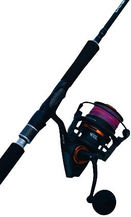
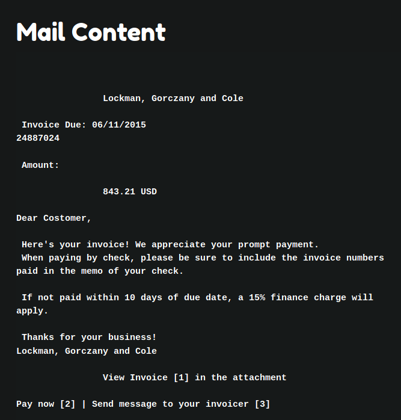
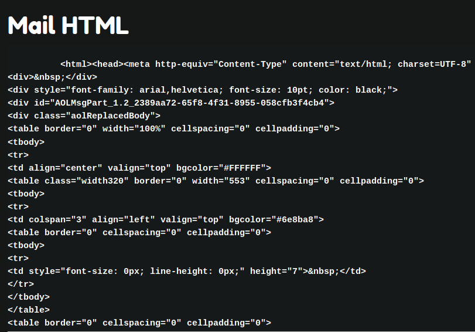
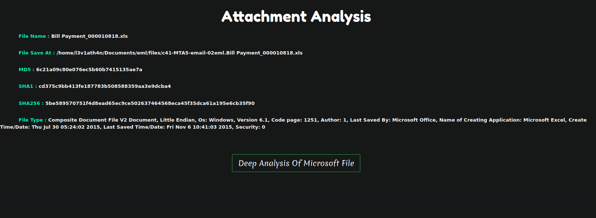
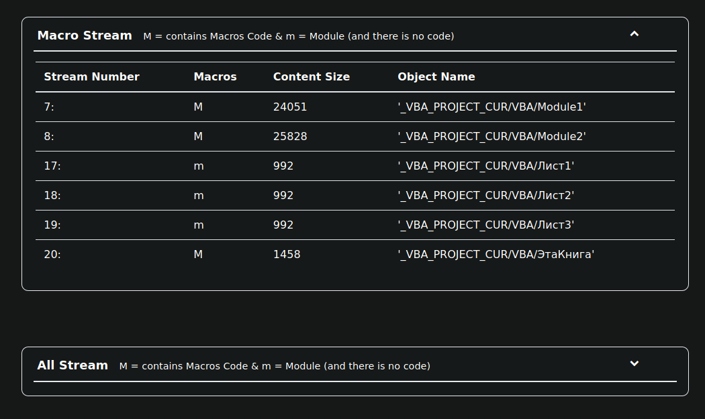
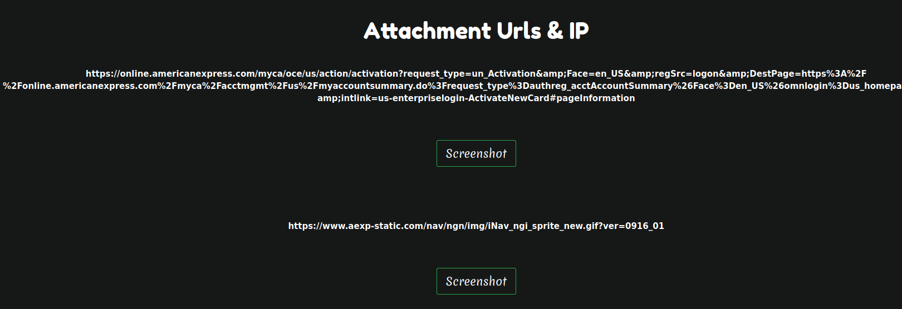
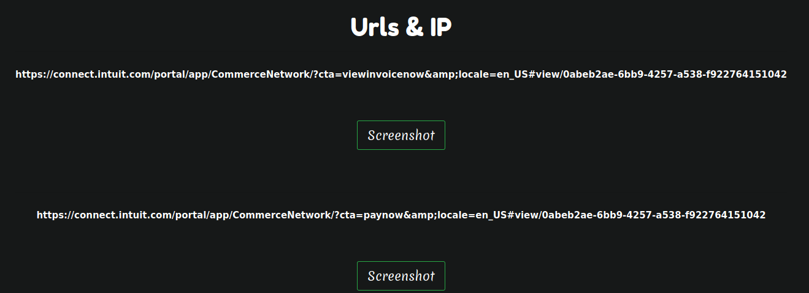

<h1 align="center">
   
  
   
  Ph1sh Gr1P
   
</h1>

<h3 align="center">EML File Analyser</h3>

### What is Ph1sh Gr1P ?

Ph1sh Gr1P is python based tool developed to analyze the emails files easily which help the investigator in Email Forensics.

### Why Ph1sh Gr1P ?

As human we can't detect all the posibilites in our invesgitaions but Ph1sh Gr1P will be the assistant for you in Email Forensics giving you every single information from a email which will eventually faster your investigation. 

### Features 

- Get Header Deatils 
- Analyse the Attachment Files 
- Shows details of Macros in Microsoft Office attachments 
- Shows Urls & IP in the Email and Attachments
- Get content and HTML of email
- Can check the urls by taking screenshots

### How to setup:

- git clone https://github.com/SatyenderYadav/Ph1shGr1P.git
- Install dependencies: pip3 install -r requirements.txt
- Setup Your SECRET_KEY in .env
- Setup the Firefox [Geckodriver](https://firefox-source-docs.mozilla.org/testing/geckodriver/Support.html) [ Setup This Using The Blog](https://www.lambdatest.com/blog/selenium-firefox-driver-tutorial/)
- python3 ph1shgr1p.py 

### Note

- Only works on Python3.7+
- Currently only working with the FireFox Geckodriver[ version : 0.29 ]

### ScreenShots

##### Home Page

##### Header Details

##### Text in Mail

##### Mail HTML

##### Attachment Analysis

##### Macros 

##### Attachment Urls

##### Urls & IP

### Credits:
oledump : Used to find Macros in stream [DidierStevens](https://github.com/DidierStevens)

